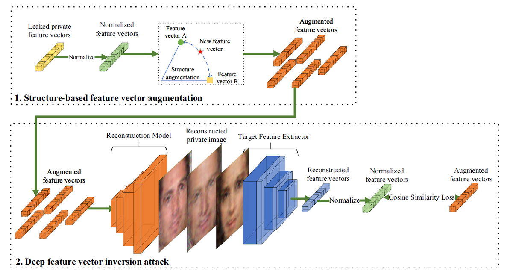

# Aug-MIA

Official code for paper: Z. Zhang and J. Huang, “Exploiting the connections between images and deep feature vectors in model inversion attacks,” Neurocomputing, p. 131457, Sept. 2025, doi: [10.1016/j.neucom.2025.131457](https://doi.org/10.1016/j.neucom.2025.131457).



## Abstract

Model inversion attack aims to reconstruct private samples from given deep neural networks. As the connections between the images and their corresponding deep feature vectors are unknown, it is difficult to utilize the information in the feature vectors during inversion. In this paper, connections between the images and their deep convolutional feature vectors are investigated. The directions of the vectors are used to represent the structures of both image vectors and feature vectors. Cosine similarity is further used to measure the structural similarity between different vectors. For a given target feature extractor, we find that the structures of the images and their feature vectors are highly correlated. Using this-property, Aug-MIA is proposed to perform model inversion with a few leaked feature vectors. In Aug-MIA, the feature vectors are first augmented by the proposed Structure Augmentation Algorithm. Then, a reconstruction model is trained using these augmented feature vectors to reconstruct images. Various experiments are performed on different datasets to validate our ideas. The results show that Aug-MIA performs better when fewer feature vectors are available. Specifically, when only 1 feature vector per class is leaked, it can improve the reconstruction rate by about 10.7 % on FaceScrub and about 4.2 % on MNIST, respectively.

## Usage

### Hardware Requirements

Any Nvidia GPU with 8GB or larger memory is enough. Larger GPU memory and system memory is better. The system memory should be larger than 16GB, 32GB+ is better for generating more feature vectors and read all the datasets. The experiments were performed on a PC with a Nvidia RTX 3080 GPU and 96GB. The code supports both Windows and Linux environment.

### Required Runtime Libraries

* [Anaconda](https://www.anaconda.com/download/)
* [Pytorch](https://pytorch.org/) --  `pip3 install torch torchvision --index-url https://download.pytorch.org/whl/cu129`
* [zhangzp9970/torchplus](https://github.com/zhangzp9970/torchplus) -- `pip install tplus`

The code is compatable with the latest version of all the software.

### Datasets

The experiments are initially performed on the MNIST dataset and the FaceScrub dataset and later performed on a large amount of datasets like CIFAR10, CelebA, TinyImageNet according to the reviewer's advice. We only provide the code for the FaceScrub dataset here. Results on other datasets can also be easily reproduced using these code.

FaceScrub -- can be downloaded and processed using [these scripts](https://github.com/zhangzp9970/FaceScrub). Crop the images using the official bounding box is enough.

We use a small powershell script to select images from the FaceScrub dataset and form the leaked dataset. The script is:

```powershell
$input_base_dir = "/path/to/FaceScrub/dataset"
$output_base_dir = "/path/to/FaceScrub1/dataset"
$dirs = Get-ChildItem -Path $input_base_dir -Name
foreach ($dir in $dirs) {
    $input_dir = $input_base_dir + "\" + $dir
    $output_dir = $output_base_dir + "\" + $dir
    New-Item -Path $output_dir -ItemType Directory
    $input_imgs = Get-ChildItem -Path $input_dir
    for ($i = 0; $i -lt 1; $i++) {
        Copy-Item -Path $input_imgs[$i] -Destination $output_dir
    }
}
```

### File Description

* face.py -- train the FaceScrub classifier.
* fattackface.py -- perform the baseline attack using only the leaked feature vectors.
* expandfeatures2face.py -- perform Structure Augmentation Algorithm on the leaked feature vectors (step 1).
* fattackexpandface.py -- perform the deep feature inversion attack (step 2).

## License

Copyright © 2025 Zeping Zhang

This program is free software: you can redistribute it
and/or modify it under the terms of the GNU General Public License as
published by the Free Software Foundation, either version 3 of the
License, or (at your option) any later version.

This program is distributed in the hope that it will be
useful, but WITHOUT ANY WARRANTY; without even the implied warranty of
MERCHANTABILITY or FITNESS FOR A PARTICULAR PURPOSE. See the GNU General
Public License for more details.

You should have received a copy of the GNU General Public License along with this program. If not, see [http://www.gnu.org/licenses/](http://www.gnu.org/licenses/).

## Citation

```bibtex
 @article{Zhang_Huang_2025, 
title={Exploiting the connections between images and deep feature vectors in model inversion attacks}, 
volume={656}, 
ISSN={0925-2312}, 
DOI={10.1016/j.neucom.2025.131457}, 
journal={Neurocomputing}, 
author={Zhang, Zeping and Huang, Jie}, 
year={2025}, 
month=dec, 
pages={131457} 
}

```

## Acknowledgements

We would like to thank Peihao Li, Shuaishuai Zhang and Chuang Liang for their valuable comments and feedback. We would also like to thank Professor Dayong Ye and Doctor Shuai Zhou for sharing the code of their paper with us. Additionally, we would like to thank the Big Data Center of Southeast University for providing the facility support for the numerical calculations in this paper. This research was sponsored by the Ant Group.
